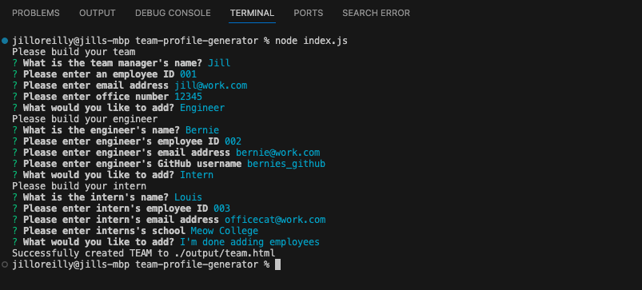
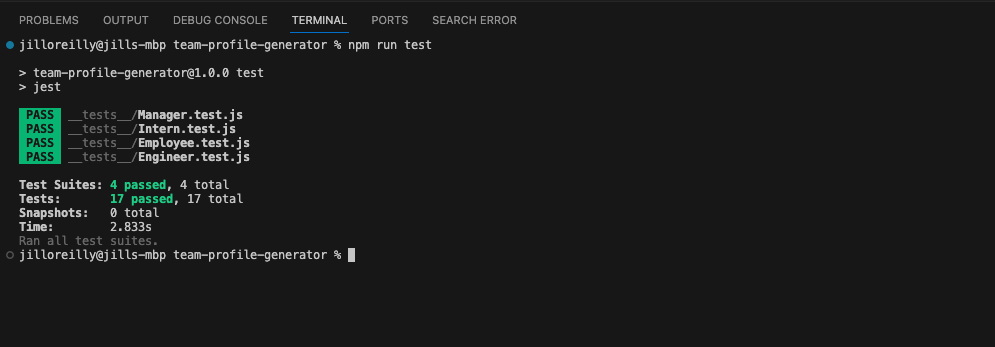

# Team Profile Generator

 

A Node.js command-line application that takes in information about employees on a software engineering team, then generates an HTML webpage that displays summaries for each person. 

  ## Table of contents:
  - [Description](#Description)
  - [Usage & Installation](#Usage--installation)
  - [Tests](#Tests)
  - [Credits](#Credits)
  - [License](#License)
  - [Technologies Used](#Technologies-used)
  - [Questions & Contact](#Questions--contact)

## Description

This Team Profile Generator showcases the JavaScript(Object-oriented programming), Test--driven development (Jest), Node.js and npm skills I have gained from Module 12 (Test-Driven Development) of the Front-end Web Development Bootcamp. 


## Usage & Installation

1. The **Team Profile Generator** can be installed by cloning the source files to your machine

2. The application will be invoked by using the following command:

   ```bash
   node index.js
   ```

3. Once opened in the command line, follow the prompts to answer questions about your team members (Manager, engineer or intern). When you are finished answering all the questions, the program will generate a team.html file to the /output directory.



***
##### Screenshot of generated  README.md file:


***

## Tests 

The application uses Jest to perform testing. To run the tests type the following command in the terminal:

   ```bash
   npm run test
   ```
All tests should pass sucessfully.



## Credits

Thank you to the following:

- [Markdown Guide - Basic syntax](https://www.markdownguide.org/basic-syntax/)

- npm: [Inquirer - prompt types](https://www.npmjs.com/package//inquirer#prompt-types)

- [Jest](https://jestjs.io/)

- Pod 2 TA **Christopher Kratz** for guiding us on the JavaScript, Node.js and npm for the challenge


## License

MIT License

Copyright (c) 2024 Jill O'Reilly

Permission is hereby granted, free of charge, to any person obtaining a copy
of this software and associated documentation files (the "Software"), to deal
in the Software without restriction, including without limitation the rights
to use, copy, modify, merge, publish, distribute, sublicense, and/or sell
copies of the Software, and to permit persons to whom the Software is
furnished to do so, subject to the following conditions:

The above copyright notice and this permission notice shall be included in all
copies or substantial portions of the Software.

THE SOFTWARE IS PROVIDED "AS IS", WITHOUT WARRANTY OF ANY KIND, EXPRESS OR
IMPLIED, INCLUDING BUT NOT LIMITED TO THE WARRANTIES OF MERCHANTABILITY,
FITNESS FOR A PARTICULAR PURPOSE AND NONINFRINGEMENT. IN NO EVENT SHALL THE
AUTHORS OR COPYRIGHT HOLDERS BE LIABLE FOR ANY CLAIM, DAMAGES OR OTHER
LIABILITY, WHETHER IN AN ACTION OF CONTRACT, TORT OR OTHERWISE, ARISING FROM,
OUT OF OR IN CONNECTION WITH THE SOFTWARE OR THE USE OR OTHER DEALINGS IN THE
SOFTWARE.

## Technologies Used


## Questions & Contact
  - View my GitHub profile here: [jilloreilly](https://github.com/jilloreilly)
  - If you have any additional questions, contact me: [jill.l.oreilly@gmail.com](mailto:jill.l.oreilly@gmail.com)


